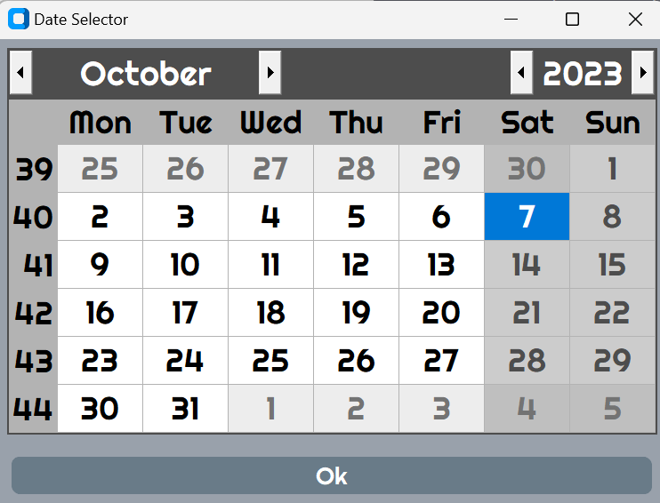
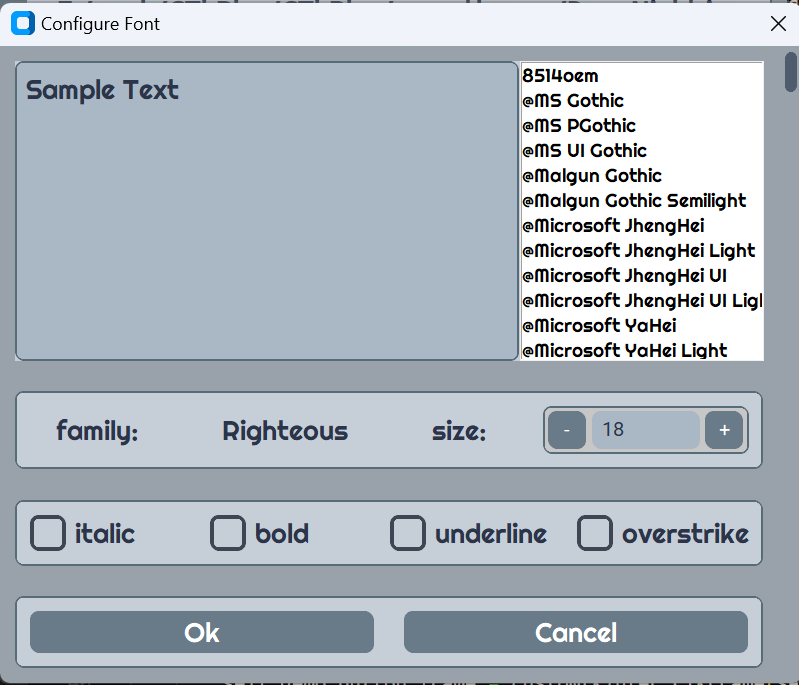
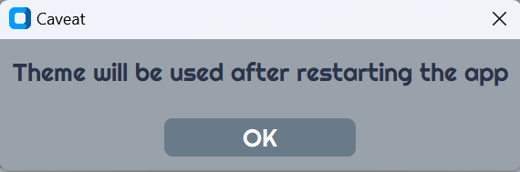
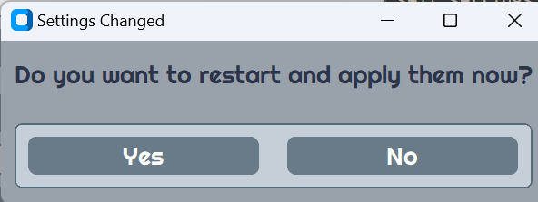
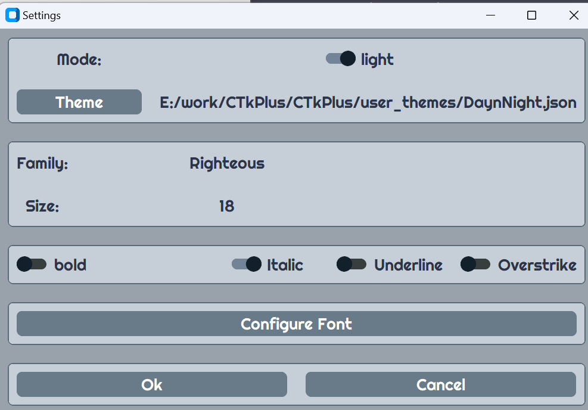
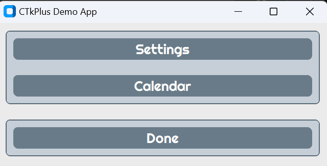

# CTkPlus
## CustomTkinter Widget Collection
A collection of widgets and dialogs for the CustomTkinter UI library, enhancing the look and feel of traditional tkinter widgets.

## The widgets
 - [CTkCalendar](#ctkcalendar)
 - [CTkFontPicker](#ctkfontpicker)
 - [CTkDialog](#ctkdialog)
 - [CTkYesNo](#ctkyesno)
 - [CTkSettings](#ctksettings)
 
## The Demo Application
 - [CTkPlusDemo](#ctkplusdemo)]

## More Information
 - [Requirements](#requirements)
 - [Credits](#credits)
 - [Additional Fonts](#additional-fonts)
______
## CTkCalendar
CTkCalendar is a dialog used to select a date. It is based on the module tkCalendar.



### Using CTkCalendar

```python
import customtkinter
from CTkCalendar import CTkCalendarDialog
from CTkDialog import CTkDialog
from datetime import date

class CalendarDialog(customtkinter.CTk):
    def __init__(self, appearance_mode='system'):
        super().__init__()

        self.custom_font = customtkinter.CTkFont(family='Ariel', size=18, weight='bold')
        self.grid_columnconfigure(0, weight=1)
        self.calendar_button_frame = customtkinter.CTkFrame(self)
        self.calendar_button_frame.grid(row=0, column=0, padx=10, pady=10, sticky='ew')
        self.calendar_button_frame.grid_columnconfigure(0, weight=1)

        self.calendar_button = customtkinter.CTkButton(self.calendar_button_frame, text="Calendar", command=self.on_calendar, font=self.custom_font)
        self.calendar_button.grid(row=0, column=0, padx=10, pady=10, sticky='ew')

    def on_calendar(self):
        dialog = CTkCalendarDialog(self, title='Date Selector', font=self.custom_font, initial_date=date.today())
        CTkDialog(self, "Selected Date", f"You selected '{dialog.result}'", font=self.custom_font)
       

app = CalendarDialog('light')
app.title("CTkPlus Calendar")
app.mainloop()
     
```

## CTkFontPicker
A CustomTkinter dialog that provides an intuitive interface for users to select and preview fonts for the GUI.



### Using CTkFontPicker

```python
import customtkinter
from CTkFontPicker import CTkFontPicker
from CTkDialog import CTkDialog

class FontPickerDialog(customtkinter.CTk):
    def __init__(self, appearance_mode='system'):
        super().__init__()
        self.settings = {
            'mode': 'light',
            'theme': 'user_themes/DaynNight.json',
            'geometry': None,
            'font':  {
                'family': 'Righteous',
                'size': 18,
                'weight': 'normal', # or bold
                'slant': 'roman',   # or italic
                'underline': False,
                'overstrike': False
            }
        }

        self.custom_font = customtkinter.CTkFont(family = self.settings['font']['family'],
                                        size=self.settings['font']['size'],
                                        weight=self.settings['font']['weight'],
                                        slant=self.settings['font']['slant'],
                                        underline=self.settings['font']['underline'],
                                        overstrike=self.settings['font']['overstrike'])
        self.grid_columnconfigure(0, weight=1)
        self.calendar_button_frame = customtkinter.CTkFrame(self)
        self.calendar_button_frame.grid(row=0, column=0, padx=10, pady=10, sticky='ew')
        self.calendar_button_frame.grid_columnconfigure(0, weight=1)

        self.calendar_button = customtkinter.CTkButton(self.calendar_button_frame, text="Font Picker", command=self.on_configure_font, font=self.custom_font)
        self.calendar_button.grid(row=0, column=0, padx=10, pady=10, sticky='ew')

    
    def on_configure_font(self):
        font = customtkinter.CTkFont(family = self.settings['font']['family'],
                                        size=self.settings['font']['size'],
                                        weight=self.settings['font']['weight'],
                                        slant=self.settings['font']['slant'],
                                        underline=self.settings['font']['underline'],
                                        overstrike=self.settings['font']['overstrike'])
        fp = CTkFontPicker(self, title='Configure Font', current_font=font)
        fd = self.settings['font']
        

app = FontPickerDialog('light')
app.title("CTkPlus CTkFontPicker")
app.mainloop()
```

## CTkDialog
## CTkYesNo

CTkDialog is a simple dialog that shows a message with an Ok button. CTkYesNo is a simple dialog that presents a question to the user who can respond yes or no.




### Using CTkDialog and CTkYesNo

```python
    def update_theme(self):

        dialog = CTkYesNo(self, message="Do you want to select a new theme?", title="Confirmation", font=self.font)
        if dialog.result:
            theme_name=customtkinter.filedialog.askopenfilename()
            self.settings['theme'] = theme_name
            self.theme_label.configure(text=theme_name)
            # self.save_settings()
            CTkDialog(self, 'Caveat', 'Theme will be used after restarting the app', font=self.font)

```
## CTkSettings

CTKSettings is a dialog that demonstrates all the widgets and dialogs in the repository. CTkSettings allows you to  dynamically change the appearance of the CustomTkinter application and serialize the appearance settings. Most settings are applied when they are changed. The theme can only be applied at startup so CTkSettings demonstrates how to restart the application to apply the settings immediately.



### Using CTkSettings

```python
    def on_settings(self):
        dialog = CTkSettings(self, settings=self.settings, font=self.custom_font)

        if dialog.result:
            self.settings = dialog.settings
            font_dict = self.settings['font']
            customtkinter.set_appearance_mode(mode_string=self.settings['mode'])
            self.custom_font = customtkinter.CTkFont(family=font_dict['family'], 
                                                    size=font_dict['size'],
                                                    weight=font_dict['weight'],
                                                    slant=font_dict['slant'],
                                                    underline=font_dict['underline'],
                                                    overstrike=font_dict['overstrike'])
            CTkDialog(self, title='Success', message="Settings updated!", font=self.custom_font)
            self.settings['font']['family']= font_dict['family']
            self.settings['font']['size']= font_dict['size']
            self.settings['font']['weight']= font_dict['weight']
            self.settings['font']['slant']= font_dict['slant']
            self.settings['font']['underline']= font_dict['underline']
            self.settings['font']['overstrike']= font_dict['overstrike']
            CTkSettings.save_settings(filename=os.path.join(self.current_directory, 'settings.json'), settings=self.settings)
            if CTkYesNo(self, "Settings Changed", "Do you want to restart and apply them now?", font=self.custom_font).result == True:
                self.restart_app()

        else:
            CTkDialog(self, title='Failure', message="Settings were not changed!", font=self.custom_font)
```

## CTkPlusDemo

The demo application provides buttons to launch the dialog boxes that demonstrate the widgets and dialogs described above.



______

## Requirements
| Module            | Installation              | Project                                                                   |
| :---------------- | :-------------------------| :-------------------------------------------------------------------------|
| CustomTkinter     | pip install customtkinter | [CustomTkinter at Github](https://github.com/TomSchimansky/CustomTkinter) |
| tkCalendar        | pip install tkcalendar    | [tkCalendar at Github](https://github.com/j4321/tkcalendar)               |

## Credits
| Theme Source      | Notes                      | Project                                                                      |
| :---------------- | :------------------------- | :----------------------------------------------------------------------------|
| ctk_theme_bullder | Themes included in CTkPlus | [ctk_theme_builder at GitHub](https://github.com/avalon60/ctk_theme_builder) |

## Additional Fonts

If you like the Google Righteous Font it can be easily installed on Windows by simply right clicking the .ttf file and selecting install from the context menu.
Installing the font on Linux takes a little extra work in a terminal windows.

```bash
cd CTkPlus/Fonts/Righteous
cp Righteous_Regular.ttf ~/.fonts
fc-cache -v -f
# validate the font
fc-list | grep Righteous

```
